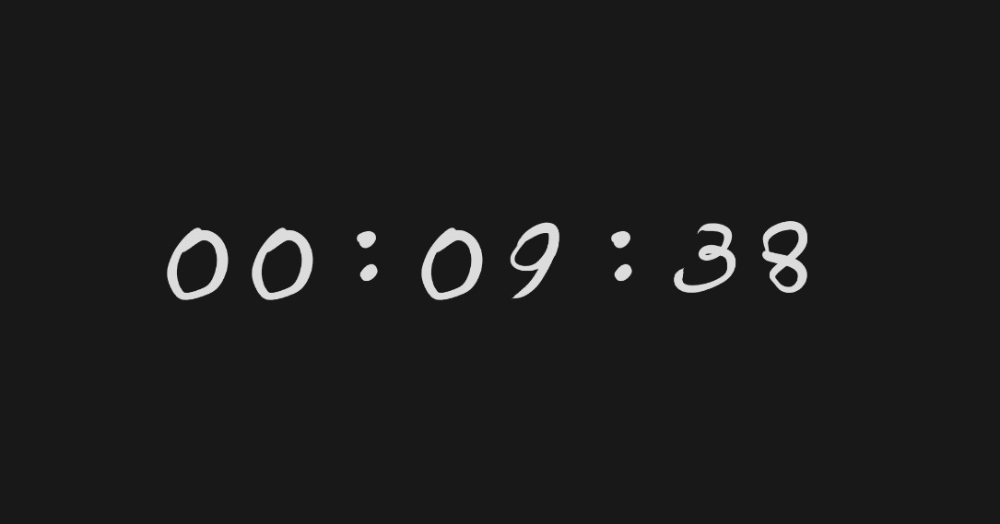

# Sowon



## Build

Dependencies: [SDL2](https://www.libsdl.org/download-2.0.php)

```console
$ make
```

## Usage

### Modes

- Ascending mode: `./sowon`
- Descending mode: `./sowon <seconds>`
- Clock Mode: `./sowon clock`

### Flags

- Start in paused state: `./sowon -p <mode>`

### Key bindings

| Key | Description |
| --- | --- |
| <kbd>SPACE</kbd> | Toggle pause |
| <kbd>=</kbd> | Zoom in |
| <kbd>-</kbd> | Zoom out |
| <kbd>0</kbd> | Zoom 100% |
