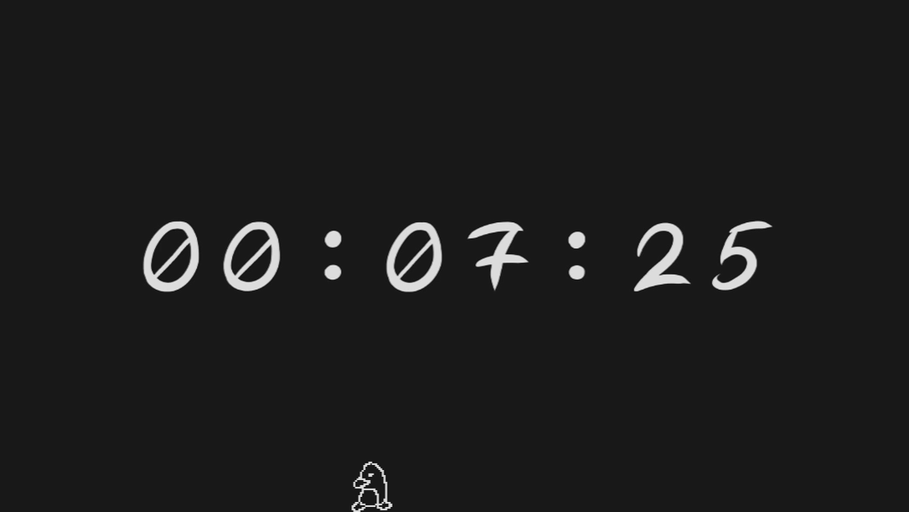

[](https://github.com/tsoding/sowon/actions)

# Sowon



## Build

Dependencies: [SDL2](https://www.libsdl.org/download-2.0.php)

### Fedora 42+
Starting with Fedora 42, the native SDL2 library is no longer available.
It was replaced by the SDL3 library. For programs that still require SDL2,
an [`sdl2-compat`](https://github.com/libsdl-org/sdl2-compat) library,
which provids a compatibility layer over SDL3, was introduced.
```console
$ sudo dnf install sdl2-compat-devel libXi-devel libXrandr-devel
$ make
$ ./sowon
```

### Debian
```console
$ sudo apt-get install libsdl2-dev
$ make
$ ./sowon
```

### MacOS

```console
$ brew install sdl2 pkg-config
$ make
$ ./sowon
```

### Windows

#### Visual Studio

- Enter the Visual Studio Command Line Development Environment https://docs.microsoft.com/en-us/cpp/build/building-on-the-command-line
  - Basically just find `vcvarsall.bat` and run `vcvarsall.bat x64` inside of cmd
- Download [SDL2 VC Development Libraries](https://libsdl.org/release/SDL2-devel-2.0.12-VC.zip) and copy it to `path\to\sowon`

```console
> cd path\to\sowon
> tar -xf SDL2-devel-2.0.12-VC.zip
> move SDL2-2.0.12 SDL2
> del SDL2-devel-2.0.12-VC.zip
> build_msvc
```

## Usage

### Modes

- Ascending mode: `./sowon`
- Descending mode: `./sowon <seconds>`
- Clock Mode: `./sowon clock`

### Flags

- Start in paused state: `./sowon -p <mode>`
- Exit sowon after countdown finished: `./sowon -e`

### Key bindings

| Key | Description |
| --- | --- |
| <kbd>SPACE</kbd> | Toggle pause |
| <kbd>=</kbd> or <kbd>+</kbd> | Zoom in |
| <kbd>-</kbd> | Zoom out |
| <kbd>0</kbd> | Zoom 100% |
| <kbd>F5</kbd> | Restart |
| <kbd>F11</kbd> | Fullscreen |
